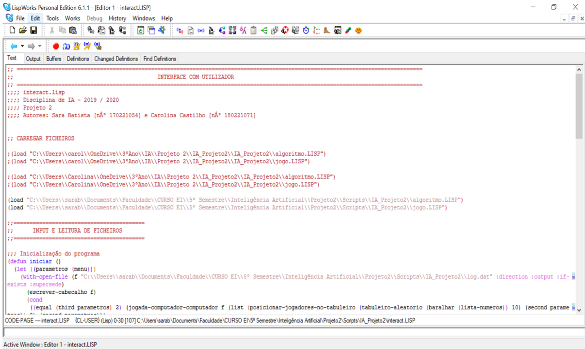
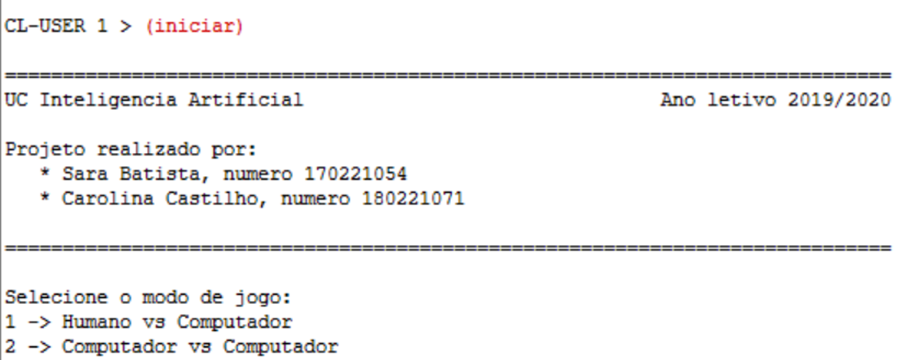
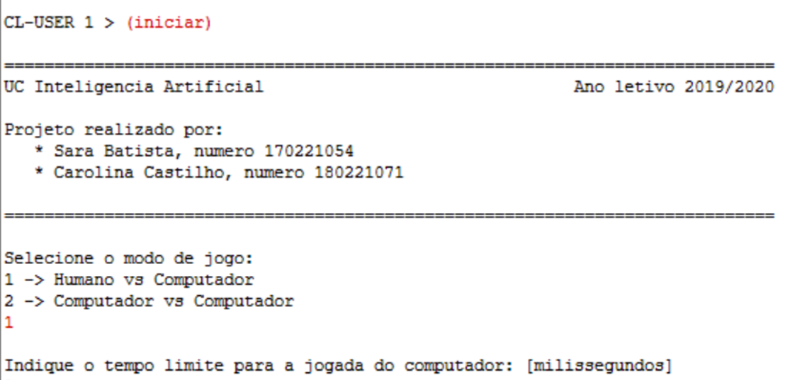
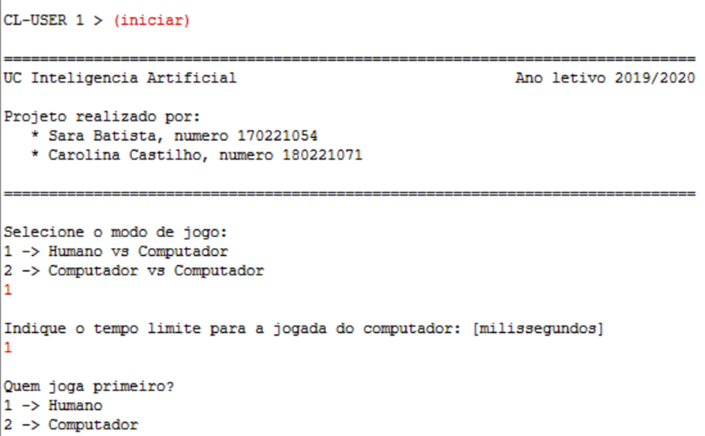
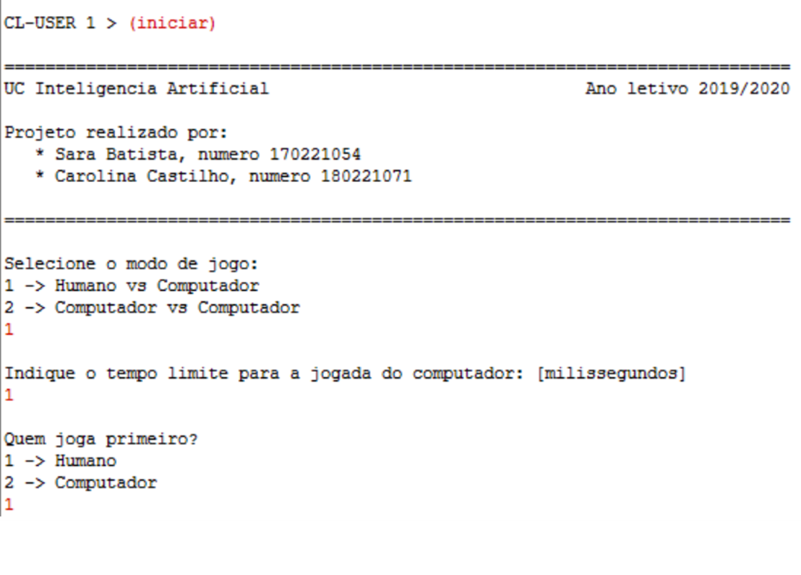
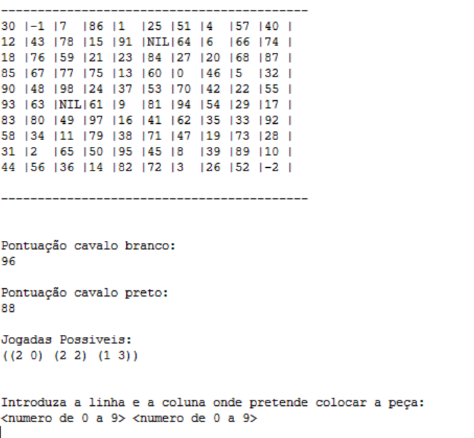

# **Manual de utilizador:** Projeto 2 

----------
Inteligência Artificial - Escola Superior de Tecnologia de Setúbal
2019/2020

Prof. Joaquim Filipe 
Eng. Filipe Mariano

----------

## **Projeto realizado por:**

* Sara Batista, nº 170221054

* Carolina Castilho, nº 180221071

  ​

## **1. Acrónios e convenções usadas**

Ao longo do programa, aplicámos as seguintes conveções:

* **Nomes de funções**: cada palavra é separada por um hífen.

* **Nomes de variáveis globais**: colocámos um "*" antes e depois do nome da variável, de modo a que se destaquem no código. 

## **2. Introdução**

Este programa é um projeto no âmbito da unidade curricular de inteligência artificial. 
Pretende-se consolidar alguns conceitos relativamente à Teoria de Jogos e respetivos algoritmos. Um dos propósitos deste projeto é a familiarização com a linguagem de programação Common LISP, principalmente por esta ser uma linguagem de programação funcional. 

## **3. Objetivos do programa**

Este programa permite jogar o "jogo do cavalo" em dois modos: Humano VS Computador e Computador VS Computador. 

O Jogo do Cavalo é uma variante do problema matemático conhecido como o Passeio do Cavalo, cujo
objetivo é, através dos movimentos do cavalo, visitar todas as casas de um tabuleiro similar ao de xadrez. Esta
versão decorrerá num tabuleiro de 10 linhas e 10 colunas (10x10), em que cada casa possui uma pontuação.

O tabuleiro tem as dimensões 10x10 em que os valores de cada casa são entre 00 e 99, sem repetição.
Cada vez que é iniciado um jogo é construído um novo tabuleiro com o valor das casas distribuído
aleatoriamente.

O objectivo do jogo é acumular mais pontos que o adversário, usando um cavalo de xadrez. Cada jogador tem um cavalo da sua cor (branco ou preto). 

> Observação: por questões de simplificação do problema, assumimos que o primeiro jogador move o cavalo branco e o segundo move o cavalo preto.

## **4. Instalação e utilização**
> **Nota:** Para poder utilizar este programa, é necessário ter o LispWorks instalado. Para isso, dirija-se ao site official do LispWorks(**http://www.lispworks.com/*) e faça o download.

* 1- Abra o LispWorks;
* 2- Abra o ficheiro ***interact.lisp***. Deverá aparecer uma janela idêntica à seguinte:
  
* 3- Compile o ficheiro no seguinte icon:
 
* 4- Repita este processo para os ficheiros ***jogo.lisp*** e ***algorithm.lisp***;
* 5- Prossiga para o **listener*, clicando neste botão:
 

Após estes passos, deverá estar apto para utilizar o nosso programa.

## **5.Exemplo de utilização**

Após ter feito todos os passos do guia de instalação, siga os seguintes passos para conseguir utilizar o programa:

* 1- Digite **"(iniciar)"**. Deverá aparecer algo idêntico à imagem seguinte no ecrã do *listener*:

 

* 2- Digite o número correspondente ao modo de jogo que pretende:

 

* 3- Digite o tempo limite para a jogada do computador:

 

* 4- Por fim, se o modo selecionado foi o **Humano VS Computador**, digite ainda o número correspondente ao primeiro jogador:

 
Após introduzidos estes dados, o jogo irá começar. 

Se for a sua vez de jogar, surgirá o tabuleiro e pontuações atuais de ambos os cavalos e as suas jogadas possíveis. Para jogar, deverá escolher a posição que mais o favoreça, introduzindo a respetiva linha e coluna. Se o seu cavalo não tiver mais movimentos possíveis, irá surgir uma mensagem a informá-lo disso, e o seu adversário terá a oportunidade de jogar, até que o jogo termine.

 

## **Divirta-se!** ;)